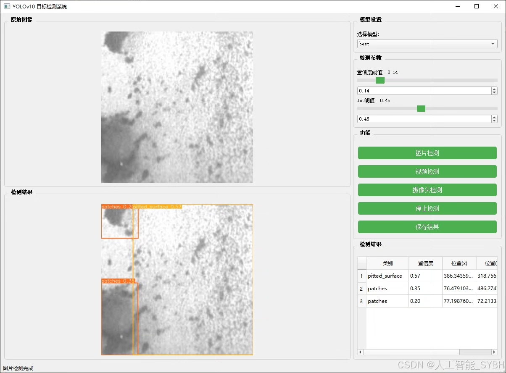
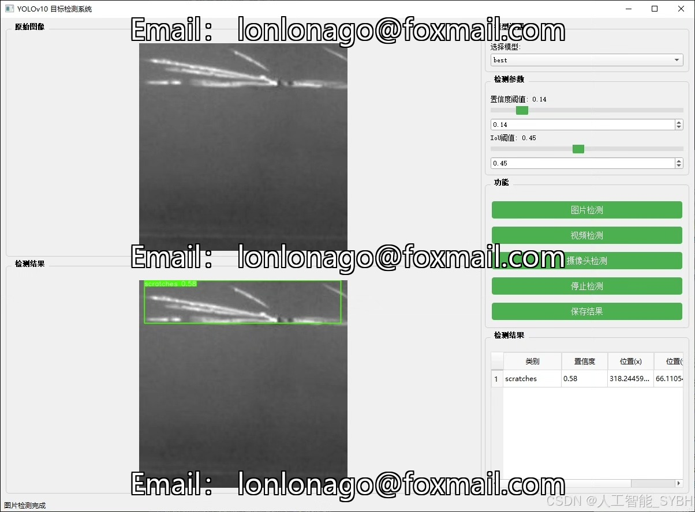
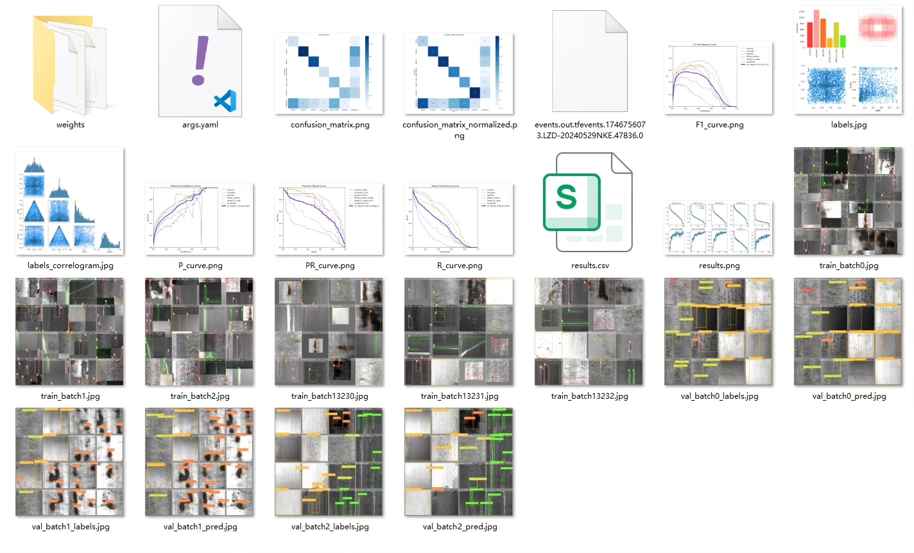
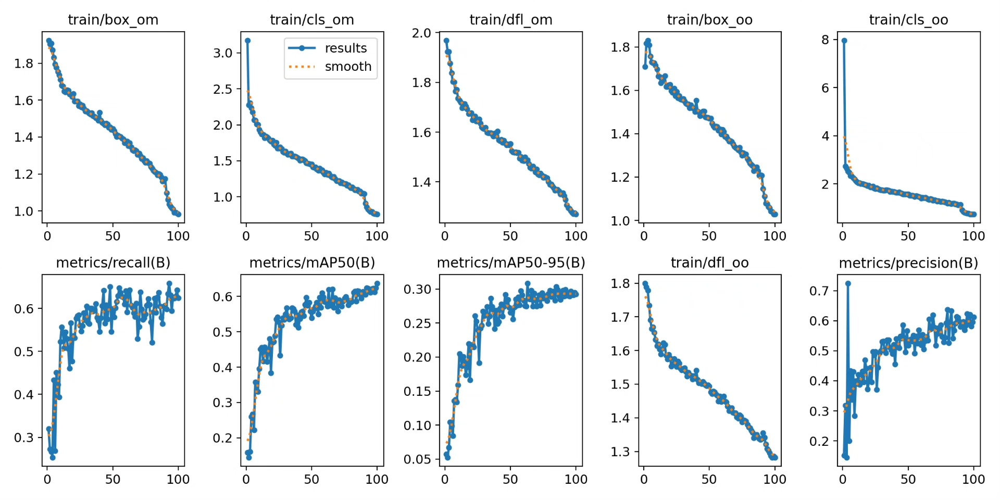
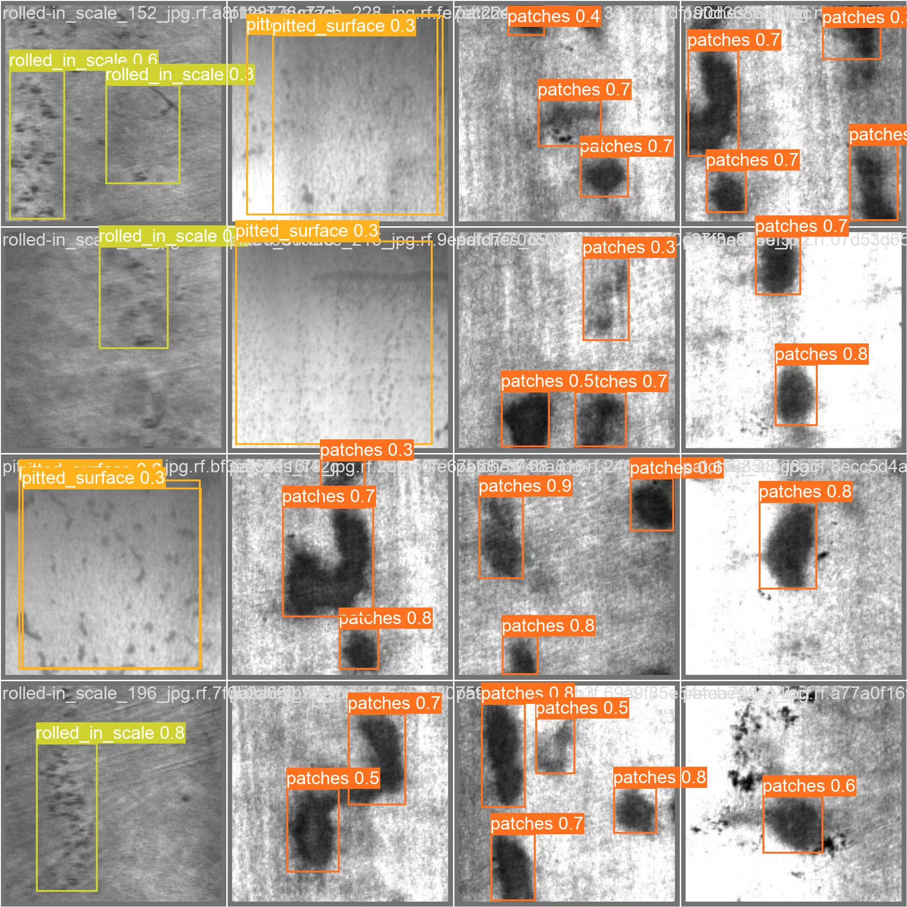
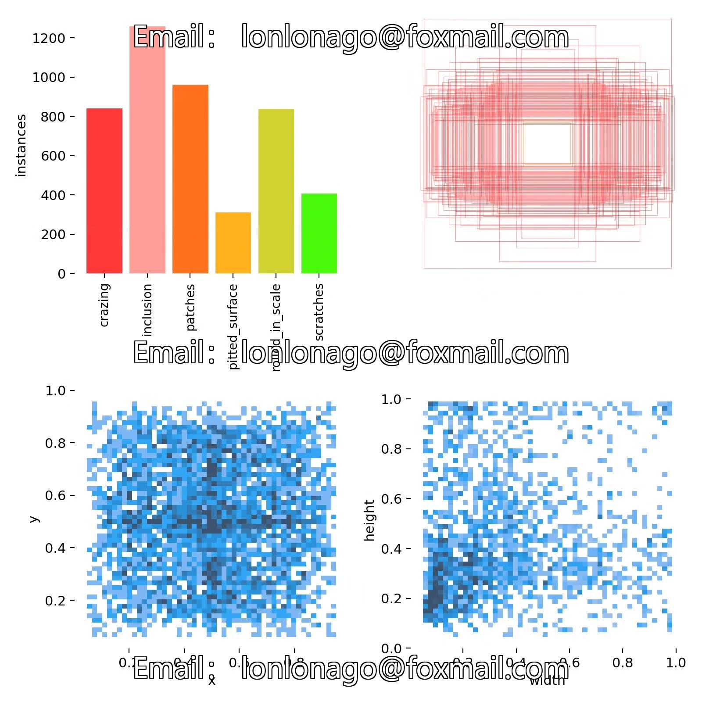
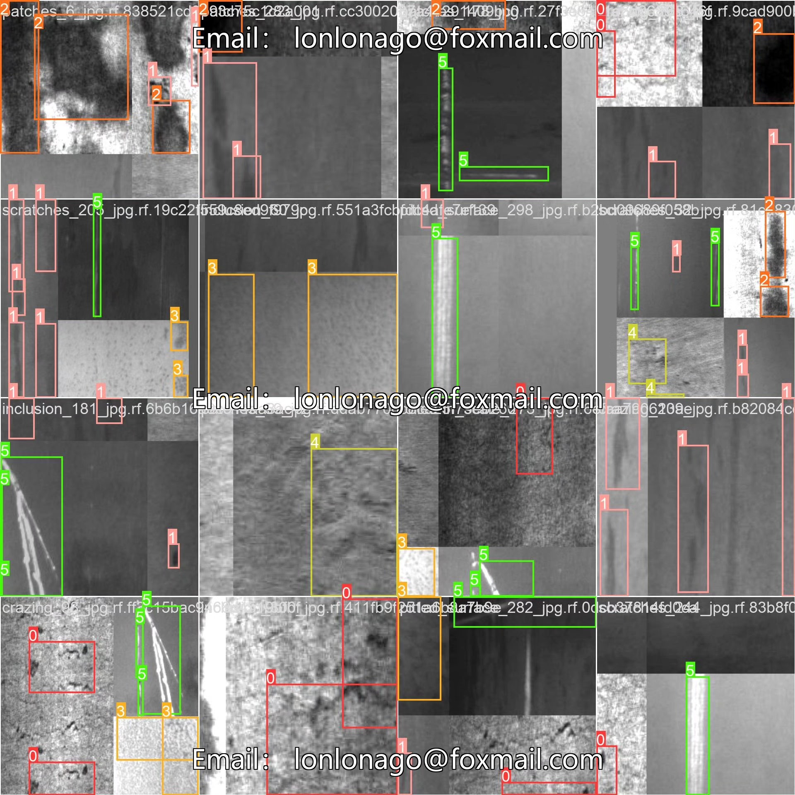

# Steel Surface Defect Target Detection System Based on Deep Learning YOLOv10 (YOL)

## Body

Based on the YOLOv10 algorithm, this project has developed an efficient steel surface defect detection system. It aims to achieve automated detection of steel surface quality during industrial manufacturing processes. The system can identify and classify six common steel surface defects: crazing (cracking), inclusion (impurities), patches (patches), pitted surface (pointed surface), rolled in scale (rolled oxide scale), and scratches (scratches). The project uses a dataset containing 2760 labeled images (2352 training set, 295 validation set, and 113 test set) for model training and evaluation. Through deep learning technology, high-precision defect detection is achieved, providing reliable quality control solutions for the steel manufacturing industry.

The company's products have obtained YOLO official commercial license certification.

We provide after-sales service.

After payment, we will provide WeChat ID for any questions.

Environment configuration: We will provide a tutorial on environment configuration, and WeChat will provide answers to questions.

Remote installation service: If you need remote configuration, an additional fee of 69 is required, with all fees refunded if the configuration fails (only refund installation fees for older computers).

Retraining dataset: After setting up the environment, you can train on your own computer. If you need us to retrain, just pay 69 plus computing power fees (2.5 yuan/hour).

Full after-sales service

## Images

## Payment

Here is a pay link on Stripe ( https://buy.stripe.com/3cs8yP7sY87d0vu9AB ). Please contact me lonlonago@foxmail.com after funding $89, and I will send you a complete data files , thank you!

